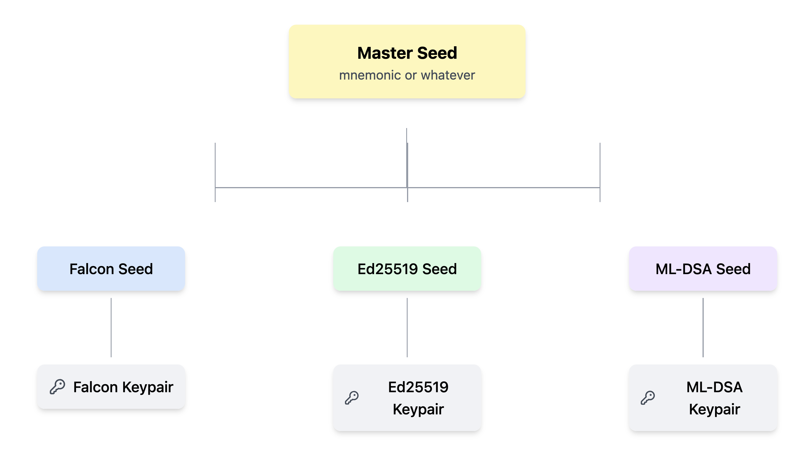

# Changelog
This document outlines the changes that need to be made to existing code for it to work properly with the latest SDK and testnet.

> [!IMPORTANT]
> After switching to the new PQC-enabled SDK, the ed25519 keypairs for existing mnemonics will change. Connected wallets, and identities will need to be connected to the new address.

## 1. Demos.connectWallet 

Instead of an ed25519 private key, `Demos.connectWallet` now accepts a master seed in the following two forms:

1. A mnemonic string (12 or 24 words)
2. A 128 byte `Uint8Array` representation of the masterseed

If you pass anything else, it will be hashed using sha3-512 to create a 128 byte master seed.


The `connectWallet` method also supports these fields in the `option` parameter:

1. `algorithm: string` - The algorithm to generate keypairs for, and use for signing transactions and transmissions. Available options are `["ed25519", "falcon", "ml-dsa"]`. Defaults to `ed25519`.
2. `dual_sign: boolean` - Only applicable when using a PQC algorithm in the previous option. If true, includes both the PQC signature and ed25519 signature in signed transactions. Defaults to `false`.

```ts
const demos = new Demos()

const mnemonic = "text source swear quantum ..."

// Default configuration: ed25519 keypair
const publicKey = await demos.connectWallet(mnemonic)

// or falcon keypair
const publicKey = await demos.connectWallet(mnenomic, {
    algorithm: "falcon",
})
```

### What is a master seed anyway?

With the introduction of Quantum-safe algorithms with support for ed25519, a lot of key types need to be generated. To keep this organized, a master seed is used together with a key derivation function to generate deterministic seeds for the various key types. These seeds are then used to generate keypairs.



## 2. Generating the master seed

Instead of using `DemosWebAuth` to generate keypairs, it's now recommended to generate a master seed mnemonic and use that with `Demos.connectWallet`.

```ts
const demos = new Demos()

// 12 words
const mnemonic = demos.newMnemonic()

// or 24 words
const mnemonic = demos.newMnemonic(256)

// connect to demos instance
const publicKey = await demos.connectWallet(mnemonic)
```

## 3. Signing transactions

Because we are now dealing with various key types, transaction signing has now been moved from `DemosTransactions` to the `Demos` object. If you are manually signing transactions, you will need to update your call to point to `demos.sign`.

```ts
const demos = new Demos()
await demos.connectWallet(mnemonic)

const tx: Transaction = await returnsUnsignedTx()
const signedTx = await demos.sign(tx)
```

## 4. Web2 Identities

The structure of the web2 payloads has changed to accomodate PQC. Payloads can now have either an ed25519 signatue or a PQC key signature.

```ts
demos:dw2p:<algorithm>:<signature>
```

The `createWeb2ProofPayload` method now takes a `Demos` instance instead of an ed25519 keypair.

```ts
const demos = new Demos()
await demos.connectWallet(mnemonic)

const identities = new Identities()
const payload = identities.createWeb2ProofPayload(demos)
console.log(payload)
```

## 5. CrossChain

The `prepareXMPayload` function now accepts a `Demos` object as the second parameter instead of an ed25519 keypair.

```diff
- prepareXMPayload(xm_payload: XMScript, keypair: IKeyPair): Promise<Transaction>
+ prepareXMPayload(xm_payload: XMScript, demos: Demos): Promise<Transaction>
```

## 6. DemosWork

The `prepareDemosWorkPayload` function now accepts a `Demos` object as the second parameter instead of an ed25519 keypair.

```diff
- prepareDemosWorkPayload(work: DemosWork, keypair: IKeyPair): Promise<Transaction>
+ prepareDemosWorkPayload(work: DemosWork, demos: Demos): Promise<Transaction>
```

